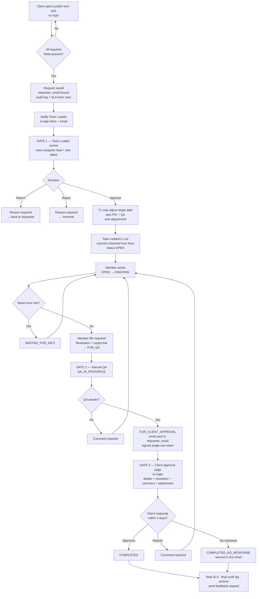

# Updated Workflow Specification

Corrected against the 22 July 2026 meeting. Supersedes the Miro board where the two conflict.

---

## 0. What the system actually is

Six modules behind one login. The Miro board only diagrams one of them (the client request lifecycle) and treats the others as boxes hanging off the Dashboard.

| Module | Purpose | Replaces |
|--------|---------|----------|
| **Dashboard** | Landing page. Time in/out shortcut, pending approvals, my open tickets, inbox | — |
| **DTR** | Daily Time Record — list of time in/out per work date | Teams / manual |
| **Approvals (Internal)** | Fixed set of HR request types: leave, no time-in, no time-out, reimbursement | Teams Approvals |
| **Forms (Client)** | Public form builder + submission intake for client requests | Teams Approvals + email |
| **Tasks / Tickets** | Lists, statuses, assignment, QA — where approved requests become work | ClickUp |
| **Timesheet** | Actual working time logged against a task | ClickUp |

Amier, 18:22–18:30 and 30:00–33:00. Two of these — Approvals (Internal) and Forms (Client) — are **deliberately separate**, because the internal approval types are a fixed, unchanging list and the client forms are user-created (Amier, 29:00: *"yung approval, ang thinking ko dyan, hindi nababago... Ngayon, yung pang-client natin, nandyan natin gagawin sa forms"*). Do not merge them into one generic "forms" table with a flag. They have different auth models (private vs public), different approvers, and different lifecycles.

---

## 1. Change log vs the Miro board

Read this before touching the board.

### Frame: Overall Workflow

| # | Change | Detail |
|---|--------|--------|
| 1.1 | `[CHANGED]` | Dashboard is not just a menu. It carries a **time in/out shortcut** so a member can punch without leaving it. Amier, 16:30: *"May in and out sa dashboard shortcut... hindi lang approval. At least approval and time in time out."* |
| 1.2 | `[CHANGED]` | `DTR`, `Approval (Internal)`, `Forms (Client)`, `Tasks`, `Timesheet`, `Notifications/Inbox` are **left-nav modules with their own list views**, not terminal boxes. The dashboard versions are shortcuts only. |
| 1.3 | `[NEW]` | Every list view is **role- and department-scoped**. Member sees only their own; manager/TL sees their assigned department(s); admin sees all. Amier, 24:00–26:30. |
| 1.4 | `[CHANGED]` | `Timesheet (Clickup)` → `Timesheet` (internal). ClickUp is the thing being replaced, not a dependency. Keep the word "ClickUp" only as a *reference note* for the team, as Kurt asked at 32:02. |
| 1.5 | `[NEW]` | There are **three** approval gates, not two. Miro shows two `Approved?` diamonds. The third — internal QA — is a distinct gate with a distinct actor. See §4. |

### Frame: Request Submission

| # | Change | Detail |
|---|--------|--------|
| 2.1 | `[CHANGED]` | `Public Form URL` is not an alternative branch — for **client** forms it is the *only* path, and it requires **no login**. Amier, 50:30: *"yung forms natin pwedeng mag-set ng public... si client, punta lang sa website, sa forms, sa shortcut, submit."* Internal approval forms are the opposite: always private/authenticated. |
| 2.2 | `[NEW]` | Submission is **rejected if incomplete**. Required by default: requester name, requester email, description, target date, plus per-form required fields (attachment where the form demands it). Amier, 55:40: *"critical, pag gumawa tayong forms, kompleto yung lalagay natin"* and 48:25: *"pagpasok pa lang ng request, dapat kumpleto na."* This is the single most important rule in the system — it is the whole commercial rationale. |
| 2.3 | `[NEW]` | **Requester email is captured and bound to the request.** It becomes the identity used at the client approval gate (§5). Without this, "only the requestor can approve" is unenforceable. |
| 2.4 | `[CHANGED]` | `Send Approval to` is drawn as an external system (Teams). It is now **internal notification + email**. Teams is being replaced (D4). |
| 2.5 | `[NEW]` | The trapezoid legend note *"Trapezoid shape signals an external system (Microsoft Teams)"* is obsolete for this app. Only outbound email remains external. |

### Frame: Request Approval

| # | Change | Detail |
|---|--------|--------|
| 3.1 | `[NEW]` | The Team Leader can **edit the request before approving** — most importantly the target date. This is negotiation, not rejection. Amier, 37:20 and 39:30: *"bago niya i-reject, try to negotiate... Bawa, yung target date na move niya ng two days, adjust niya na."* Miro has no edit-at-approval step. |
| 3.2 | `[NEW]` | At approval the TL sets **two** people, not one: `PIC` (assignee) **and** `QA` (defaults to the TL, overridable to another member). Amier, 41:30: *"Pwede rin may QA doon na field... By default, si Team Leader yung naka-assign. Pero, pwedeng nase-select."* Miro only has `Assign Assignee`. |
| 3.3 | `[NEW]` | The stated purpose of this gate is **capacity control**, not paperwork. The TL is explicitly assessing whether the assignee's current load can absorb the request by the target date, and is expected to push back. Amier, 37:00–38:30. Build the screen so the TL can *see* the assignee's open ticket count and due dates at decision time, or the gate is theatre. |
| 3.4 | `[CHANGED]` | Rejection is a last resort with a **mandatory reason**, and `Return for Revision` sends the request back to the requester with that reason visible. Keep Miro's structure, add the required-reason constraint. |

### Frame: Ticket Processing

| # | Change | Detail |
|---|--------|--------|
| 4.1 | `[CHANGED]` | Title `Ticket Processing (CLICKUP/WEB APP)` → `Ticket Processing`. Internal only. |
| 4.2 | `[CHANGED]` | **Status order is wrong in Miro.** Miro has `Testing/QA → Completed → Submit for Final Approval`. Completed must be the *terminal* state, after client sign-off. Corrected set in §3. Amier corrected himself live at 42:30: *"Yung Finish dapat for QA."* |
| 4.3 | `[NEW]` | Before a member can move a ticket to `For QA`, they must fill a **required resolution / output field** describing what was done, plus the output link or attachment. Amier, 52:00–53:00: *"May isa ka lang field doon na text field... Resolution, parang ganon."* This is currently missing entirely and is what makes the client approval email meaningful. |
| 4.4 | `[NEW]` | Task columns **mirror the originating form's fields**. Amier, 41:00: *"lahat ng column galing dyan sa form."* Name, description, target date, attachment, PIC, QA, status — plus any custom fields the form defined. |
| 4.5 | `[NEW]` | Tasks live in **Lists**, and a list can be fed manually or automatically from a form. Amier, 33:00: *"May list ka doon ng pang helpdesk... Yung entry niyang list, pwede man galing sa forms. Pwede rin manual."* |

### Frame: Completion Approval (Client)

| # | Change | Detail |
|---|--------|--------|
| 5.1 | `[NEW]` | **No login, ever.** The client gets an email containing a link to a public approval page. Amier, 49:00: *"ang approval nun is email lang. So si client, hindi niya kailangan mag-login."* |
| 5.2 | `[NEW]` | **Only the original requester may approve.** Amier, 43:30: *"Kung sino lang yung requestor, siya lang dapat yung mag-a-approve."* Implementation: signed token bound to `request.requester_email`, not a shared link. See `[RISK] R2` in `10-open-questions.md`. |
| 5.3 | `[NEW]` | The approval page shows: request details, the resolution text, output link/attachments, a **comment box**, an optional **attachment upload**, and `Approve` / `Reject` buttons. Amier, 53:30. |
| 5.4 | `[CHANGED]` | Miro wires `Approval exceeds 3 days` as a branch off the `Approved?` diamond, which is unreadable. It is not a decision the client makes — it is a **timer that fires when no decision arrives**. Redraw as a timeout edge from `Client Reviews`. |
| 5.5 | `[NEW]` | The auto-complete rule must be **stated in the email itself**. Amier, 54:00: *"sa email, na pag di tayo nakareceive ng response within 3 days, we will tag it as complete."* An auto-close the client was never warned about is a dispute waiting to happen. |
| 5.6 | `[NEW]` | On reject, the ticket returns to `Ongoing` with the client's comment attached — and the SLA clock behaviour on that return needs a decision (`10-open-questions.md`, Q6). |

### Frame: Ticket Closure

| # | Change | Detail |
|---|--------|--------|
| 6.1 | `[NEW]` | A **feedback request is sent per completed request**, not once per quarter. Amier, 54:30: *"Every request, nare-rate tayo... mas realistic kung every request, may chance silang magbigay ng feedback."* |
| 6.2 | `[CHANGED]` | `Notify Stakeholders` drawn as Teams → internal notification + email. |
| 6.3 | `[NEW]` | Distinguish `Completed (client approved)` from `Completed (no client response)` in the archive and in reporting. They are not the same outcome and collapsing them destroys the metric that justifies the whole build. |

---

## 2. Roles and visibility

Amier gave two conflicting role lists in the same conversation:

- 24:15 — *"Member, manager, admin"* with *"Si team leader, pwede na lang natin siyang itag as manager."*
- 37:20 — *"Lagyan mo nga rin ang role na team leader."*

**Resolved: four roles** (D6). The *duties* described for TL — assess capacity, assign PIC, set QA, negotiate dates — are operationally distinct from a department manager's oversight, so they stay separate roles.

| Role | DTR | Internal Approvals | Client Forms | Tasks |
|------|-----|--------------------|--------------|-------|
| **Member** | own records only | own submissions only | — | tickets assigned to them |
| **Team Leader** | own + assigned dept(s) | approves for assigned dept(s) | manages forms for their dept | approves requests, assigns PIC/QA, sees dept board |
| **Manager** | assigned dept(s) | approves for assigned dept(s) | view | dept board |
| **Admin** | all | all | all | all |

**Department assignment is many-to-many.** Amier, 26:00: *"pagka-check ko lahat, manager ako ng BizBytes, BizBooks, BizAssist, kita ko lahat yun. So checkbox, multiple."* A user has one role; a manager/TL has a set of departments they oversee.

*(Note: the "management = read/view only" remark at 13:50 was about GoHighLevel account permissions, not this web app. Do not build it here unless Amier asks.)*

---

## 3. Canonical status sets

Do not invent variants. These strings go in the DB as enums.

### Request (a form submission, before it becomes work)

```
DRAFT → SUBMITTED → PENDING_REVIEW → ┬─ APPROVED  (creates a Task)
                                     ├─ RETURNED  (back to requester, reason required)
                                     └─ REJECTED  (terminal, reason required)
```

### Task / Ticket (created on request approval)

```
OPEN → ONGOING → FOR_QA → QA_IN_PROGRESS → FOR_CLIENT_APPROVAL → ┬─ COMPLETED
                                                                 └─ COMPLETED_NO_RESPONSE
```

Return edges:
- `QA_IN_PROGRESS → ONGOING` — QA rejects, comment required
- `FOR_CLIENT_APPROVAL → ONGOING` — client rejects, comment required
- `ONGOING → WAITING_FOR_INFO → ONGOING` — kept from Miro's `Need More Info` branch; **[RISK] R4**: this pauses the SLA clock and is the obvious place for the clock to be gamed. Log who paused it and for how long.

### Internal Approval (leave, no time-in, no time-out, reimbursement) — Phase 5

```
SUBMITTED → PENDING_APPROVAL → ┬─ APPROVED
                               └─ REJECTED  (reason required)
```

---

## 4. Corrected end-to-end flow



### The commercial point of this flow

Amier spent roughly ten minutes (43:00–56:00) on one argument, and it should survive into the build: **VizServe is currently absorbing the client's internal approval bottleneck**, which destroys VizServe's SLA without VizServe having any control over it. The recruitment MRF example (54:00) and the purchasing example with incomplete quantities (46:00) are the same failure twice.

The fix is structural, not procedural:

1. Clients complete *their own* internal approval **before** submitting (in their Teams, not ours).
2. The form refuses incomplete submissions, so back-and-forth cannot start.
3. Only the requester signs off at the end, so a committee cannot re-open scope.
4. Non-response auto-completes, so the clock stops.

Every one of those four is a *feature with an owner in this doc set*. If a phase ships without one of them, the platform is ClickUp with extra steps. That is the acceptance test.

---

## 5. Flows not yet drawn in Miro

These need new frames. Full detail in `09-later-phases.md`; the rules are recorded here so they are not lost.

### DTR (Daily Time Record)

Amier, 19:10–21:00. Rules as stated:

- Default view is a **list** of time in / time out per date.
- **Earliest time-in of a work date wins.** Punching in again later does not overwrite.
- **Latest time-out of a work date wins.** Punching out again later does overwrite.
- The user **selects the date** the punch attaches to — but this is **allowed for time-out only, not time-in**, and only for the next calendar day. Purpose: overnight OT. His example: in at 22:00 on 22 July, out at 01:00 on 23 July, must land on the 22 July record or the day reads as "no out."

**[RISK] R3** — as stated, "user selects the date" plus "earliest in wins" is exploitable and un-correctable. Recommended constraint, for Amier to confirm: the server timestamp is always authoritative; the date picker only chooses *which work_date the punch attaches to*, limited to today or yesterday; a punch made in error is fixed by a `No Time-In` / `No Time-Out` request through the Approvals module — which is exactly why those two form types exist. See Q4.

### Internal Approvals

Fixed types at launch: **Leave**, **No Time-In**, **No Time-Out**, **Reimbursement**. Amier, 22:00–23:30.

Leave balances were **deliberately out of scope for v1** — HR / Sir Joel counted manually. Amier, 22:40: *"tayo naman ngayon, ma-implement lang ng pinakamabilis... Ang mahalaga lang, may record."*

**Reversed on 24 Aug 2026 — see `D27`.** Balances now exist, per leave type, as an allocation an admin types plus usage computed from approved requests. What stayed waved off is the part he was actually warning about: **accrual, carry-over and pro-rating**. Nothing earns days over time, nothing rolls anything into next year, and nothing refuses a request that overdraws. That line is still the scope trap; only the allocation crossed it.

### Timesheet

Amier, 33:20. Time is logged **against a task selected from the list** — free-text logging is not allowed. *"mamap niya yung item mo sa list... hindi ka rin pwede-pwede mag-log ng gusto mo."*

The screen is a **week grid** — tasks down the side, the seven days across the top, a duration typed into the cell. ClickUp's shape, deliberately (`D21`), and the rule above survives it because every row *is* a task: there is no cell not attached to real work. Detail in [09-later-phases.md](09-later-phases.md) §Timesheet shape.

Not every task comes from a client request. Tasks created by hand (`P3-12`, `request_id` null — see §4.5 above) are logged against exactly the same way, which is how internal work that never touched a form still shows up in the week.

### Inbox / Notifications

Amier, 20:30–21:30. One place showing: requests pending *your* approval, and status changes on requests *you* submitted. Unread count is a nice-to-have he explicitly deferred: *"kahit wala muna, mga improvement na yun."*
