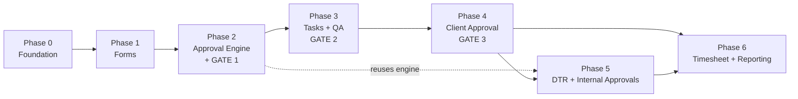

# Phase Roadmap

**This document is the plan of record.** Dependency-ordered phases, each with a scope boundary, a two-track task split, and binary exit criteria. **No dates, no sprints, no time-boxing.**

---

## First, an honest word about scope

At 57:32 the answer to "which module first" was *"Sabay-sabay"* — all at once.

That is how this build fails. Six phases, two developers, both already carrying GHL, SIS, and HFSE delivery work. Amier corrected the instinct thirty seconds later by naming forms/tickets/tasks as the critical path and saying DTR and approvals can keep riding on Teams.

The phases below are strictly ordered. Each produces something usable before the next starts. **If a phase is running long, cut scope inside the phase — never start the next one in parallel to feel faster.**

### Working without dates — what replaces them

Dropping time-boxing is the honest choice when velocity is genuinely unknown, and with Kurt splitting time on GHL it is. But it removes the mechanism that normally surfaces an overrun early, so two things have to carry that weight instead:

1. **The exit criteria are binary.** Every one of them is checkable — a test passes or it does not, a `curl` is rejected or it is not. A phase cannot drift while feeling productive if the criteria are reviewed honestly.
2. **Relative sizing, not calendar sizing.** The phases are not equal. Phase 3 is roughly twice the size of Phase 0 and comes with a pre-planned split. Knowing which phases are big is more useful than pretending each takes N weeks.

Agree with Ace and Kurt that exit criteria get reviewed at some regular checkpoint — whatever rhythm suits — even though nothing has a deadline. Criteria nobody looks at are decoration.

---

## Relative sizing

Rough effort, phase against phase, so nobody is surprised by which ones are heavy:

| Phase | Relative size | Note |
|---|---|---|
| 0 Foundation | ▓▓ medium | Mostly schema and plumbing; the scope test suite is the real work |
| 1 Forms | ▓▓▓ large | Form builder plus a public, unauthenticated surface that must be hardened |
| 2 Approval Engine + Gate 1 | ▓▓ medium | Small surface area, high care — the engine is reused twice |
| 3 Tasks + QA | ▓▓▓▓ **largest** | **Expect to split.** Board, list, status machine, QA screens, manual tasks |
| 4 Client Approval | ▓▓▓ large | Security-sensitive; email deliverability is an unknown until tested |
| 5 DTR + Internal Approvals | ▓▓ medium | Reuses the Phase 2 engine; DTR date logic is the hard part |
| 6 Timesheet + Reporting | ▓▓ medium | Mostly reads over data that already exists |

**The ClickUp subscription runs until Phase 6.** If cancelling it is the goal, that is five phases away. Worth knowing when the renewal lands — it may change how Phase 6 is prioritised. It cannot justify an interim partial migration: `D21` rules out moving data at all, in either direction.

---

## The two tracks

Ace and Kurt build in parallel. The split follows the natural seam in the stack, and roughly matches who was doing what in the meeting.

| | **Ace track** | **Kurt track** |
|---|---|---|
| Owns | Migrations, RLS policies, Postgres functions, state machines, server actions, cron jobs, tests | Screens, layouts, shadcn components, form rendering, email templates, navigation |
| Boundary | Everything from the API contract down | Everything from the API contract up |
| Handoff artefact | A typed API contract + zod schema in `lib/schemas/`, agreed at the **start of each phase** | Screens built against that contract, mocked until the server side lands |

**The handoff artefact is what makes parallel work possible.** Agree the zod schemas before either track writes code, and both can run without blocking. Skip it and Kurt waits on Ace in every phase.

**Shared, owned by neither:** the phase's exit criteria. Neither track is done until they pass end to end.

---

## Dependency graph

**Phases 0–4 are the product.** Phases 5–6 are the ClickUp/Teams retirement. Do not let 5 and 6 jump the queue because they feel easier.

---

## Phase 0 — Foundation

**Doc:** `04-phase-0-foundation.md`

Auth (Entra SSO **and** email/password), users, four roles, departments, app shell with role-based navigation, audit log primitive, notification/inbox primitive.

**Why first:** Amier, 58:20 — *"prerequisite nyan, yung login, yung role, yung user, kailangan yan."* Nothing else can be scoped or tested without it.

**All four blockers answered** — four roles, dual auth, single-tenant, new dedicated Supabase project with the `vizserve_pms_` prefix. Nothing gates this phase now.

| Ace | Kurt |
|---|---|
| P0-01 repo/env · P0-02 base schema · P0-05 authz layer · P0-06 RLS · P0-09 audit log · P0-10 notifications · P0-12 scope tests | P0-03 auth · P0-04 user management screens · P0-07 app shell + nav · P0-08 dashboard skeleton · P0-11 email verification |

**Exit criteria**

- [ ] A user can log in and land on a dashboard.
- [ ] All four roles exist and the left nav renders differently for each.
- [ ] Both auth paths work, and the same email via either resolves to one user profile.
- [ ] A manager assigned to two departments sees exactly two departments' worth of seeded data; a member sees only their own. **Verified by test, not by clicking around.**
- [ ] Every table and enum type carries the `vizserve_pms_` prefix. RLS is on; a wrong-role query returns zero rows, not an error.
- [ ] An audit log row is written on user create/edit.
- [ ] A test email sends and lands in an inbox, not spam.

---

## Phase 1 — Forms

**Doc:** `05-phase-1-forms.md`

Form builder, public form URLs, server-side completeness validation, request records, attachments, SLA timer, TL notification.

| Ace | Kurt |
|---|---|
| P1-01/02 migrations · P1-07 submission endpoint · P1-08 identity capture · P1-09 attachments · P1-10 reference numbers · P1-11 SLA timer · P1-15 abuse controls | P1-03 form builder UI · P1-04 form settings · P1-05 forms list · P1-06 public form page · P1-12 notifications · P1-13 requests list · P1-14 request detail |

**Contract:** the runtime zod schema generated from `form_fields`. It is shared by the public form renderer and the server-side validator — which is how the completeness rule gets enforced on both sides without being written twice.

**P1-16 seeds two placeholder forms** through the builder. Forms are dynamic (D20) — the field list is configuration, not a spec to agree up front.

**Exit criteria**

- [ ] Staff can build a form and publish it to a public URL.
- [ ] A client with no account can submit from a browser with no session.
- [ ] A submission missing a required field is **rejected server-side**, proven by a direct API call that bypasses the UI.
- [ ] A submitted request appears in the correct TL's queue and nowhere else.
- [ ] Two placeholder forms exist, built through the builder, each routing to a department.
- [ ] A field can be renamed without breaking existing requests, and a field with data cannot be hard-deleted.
- [ ] Rate limiting demonstrably blocks a submission flood.

---

## Phase 2 — Approval Engine + Gate 1

**Doc:** `06-phase-2-request-approval.md`

**Builds the approval machinery once, generically**, then wires the client-request Team Leader gate onto it as its first consumer. Phase 5's internal approvals plug into the same engine with **no new engine work** — only a new request type and a new form.

The engine, stated plainly: *a pending item, routed to an approver by department, with approve / return / reject, a mandatory reason on the negative paths, an audit entry, and a notification.* Everything specific to client requests — the capacity panel, PIC/QA assignment, task creation — sits **on top** of it, not inside it.

| Ace | Kurt |
|---|---|
| P2-00 generic engine · P2-02 capacity query · P2-03 edit-before-approve · P2-07 approval transaction · P2-08/09 return + reject · P2-13 authz tests | P2-01 review screen · P2-02 capacity panel UI · P2-04/05 PIC + QA selectors · P2-06 list selector · P2-10 pending queue · P2-11 dashboard shortcut · P2-12 notification surfacing |

**Contract:** the decision payload schema.

**Exit criteria**

- [ ] The engine is generic — a throwaway second request type routes through it end to end without touching engine code.
- [ ] A TL sees each candidate assignee's open ticket count and nearest due dates **on the review screen**.
- [ ] Approving with an adjusted date stores **both** dates and creates a task due on the adjusted one.
- [ ] Return and reject refuse to submit without a reason; the reason reaches the requester.
- [ ] Approval is atomic — a forced mid-transaction failure leaves no partial state.
- [ ] PIC and QA are both set and both notified.
- [ ] Cross-department authorization tests green.

---

## Phase 3 — Tasks and Internal QA (Gate 2)

**Doc:** `07-phase-3-tasks-qa.md` · **Largest phase in the set**

Lists, task views, status transitions, required resolution field, QA hand-off and rejection, manual tasks, `WAITING_FOR_INFO`.

**Pre-planned split — decide early, not late:**

- **3a** — lists, task list view, task detail, status machine, resolution gate, manual tasks
- **3b** — QA screens, QA pass/reject, board view, `WAITING_FOR_INFO` reporting

3a alone is a usable increment. A half-finished Phase 3 is not, and it is the worst place in the whole plan to stall, since Phase 4 depends on it entirely.

| Ace | Kurt |
|---|---|
| P3-01/02 migrations · P3-06 status machine · P3-07 resolution DB gate · P3-09/10 QA pass + reject · P3-11 waiting-for-info · P3-13 attachments · P3-15 scope tests | P3-03 task list view · P3-04 board view · P3-05 task detail · P3-08 QA screen · P3-12 manual creation · P3-14 my tasks + dashboard card |

**Contract:** the task zod schema plus the legal-transition table, as a typed constant both tracks import.

**Exit criteria**

- [ ] Every legal transition works; every illegal one is rejected server-side.
- [ ] A direct API call cannot reach `FOR_QA` with an empty resolution.
- [ ] QA rejection returns to `ONGOING` with the comment visible to the PIC.
- [ ] Task list columns reflect the originating form's fields.
- [ ] Tasks can be created manually, without a request.
- [ ] `WAITING_FOR_INFO` duration is queryable per task.

---

## Phase 4 — Client Approval (Gate 3) and Feedback

**Doc:** `08-phase-4-client-approval.md`

Signed-token email, public approval page, approve/reject with comment and attachment, 3-day auto-complete with reminders, feedback, archive.

**At the end of this phase the platform replaces the client-facing half of Teams Approvals.** First point at which the build has paid for itself.

| Ace | Kurt |
|---|---|
| P4-01 token migration · P4-02 issuance · P4-05 decision handler · P4-06/07 approve + reject paths · P4-09 Vercel cron auto-complete · P4-11 feedback storage · P4-12 archive · P4-13 security tests | P4-03 approval email · P4-04 public approval page · P4-08 reminder emails · P4-10 feedback request · P4-14 deliverability check |

**Start P4-14 deliverability testing early in the phase.** It is the one item where a late failure has no workaround.

**Exit criteria**

- [ ] A client receives an email, clicks, and approves without logging in.
- [ ] Security tests green — especially cross-task token reuse and replay.
- [ ] Reject returns the task to `ONGOING` with the comment reaching the PIC.
- [ ] Reminders fire before auto-complete; auto-complete fires on schedule; the deadline is stated in the email body.
- [ ] `COMPLETED` and `COMPLETED_NO_RESPONSE` are distinguishable in the archive.
- [ ] Feedback goes out on every completion and results are queryable.

---

## Phase 5 — DTR and Internal Approvals

**Doc:** `09-later-phases.md`

**Retires:** Teams Approvals, internal half. Reuses the Phase 2 engine — the approval logic is not rebuilt.

| Ace | Kurt |
|---|---|
| P5-01/05 migrations · P5-02 punch logic · P5-07 routing onto the existing engine · P5-08 decisions · P5-09 DTR correction write-back · P5-11 export · P5-12 `lib/dates.ts` extension | P5-03 dashboard punch shortcut · P5-04 DTR list view · P5-06 the four request forms · P5-10 approvals list view |

**Exit criteria**

- [ ] Double punch-in does not change time-in; double punch-out does update time-out.
- [ ] An OT shift ending 01:00 lands on the prior work date.
- [ ] All four internal request types submit and route correctly **through the Phase 2 engine**.
- [ ] An approved No Time-In **actually corrects** the DTR record.
- [ ] **No leave-balance logic exists.** Deliberate.
- [ ] Payroll can export a month of DTR.

---

## Phase 6 — Timesheet, Reporting, Archive

**Doc:** `09-later-phases.md`

**Retires:** ClickUp. This is the phase that lets the subscription be cancelled (56:30).

**No data comes across (D21).** No sync, no export/import, no parallel run — `P6-10` is withdrawn. ClickUp is a *feature* reference from here on: copy the interactions the team already knows, starting with the timesheet week grid. The subscription is switched off, not migrated.

| Ace | Kurt |
|---|---|
| P6-01 migration · P6-04 turnaround reporting · P6-06 negotiation + auto-complete splits · P6-08 archive · P6-09 exports | P6-02 timesheet grid · P6-03 week navigation and totals · P6-05 dashboards · P6-07 feedback report |

**Exit criteria**

- [ ] Time cannot be logged without a task.
- [ ] A week of one member's work can be entered from the grid without leaving it.
- [ ] All seven metrics in `09-later-phases.md` are reportable with a date range.
- [ ] Archived requests remain queryable.
- [ ] Every report the team currently reads in ClickUp has an equivalent here.

---

## Testing is inside the phase, not after it

There is no testing phase at the end. Practically:

- Ace writes the scope and authorization tests **with** each migration.
- Kurt's screens build against the agreed zod contract from the start of the phase, so integration is continuous rather than a big-bang at the end.
- The exit criteria go into the tracker when the phase **starts**, not when someone thinks it might be finished.

A phase whose tests are all still unwritten is not nearly done, however complete the screens look.

---

## What to build in parallel with all of this

One thing only: **the mockups**. Amier, 58:30 — finalise the workflow, hand it to Claude, get front-end designs, then build.

Mockups for Phase N+1 while building Phase N is safe and useful, and it is a natural fit for Kurt's track. Building Phase N+1 while building Phase N is not.
